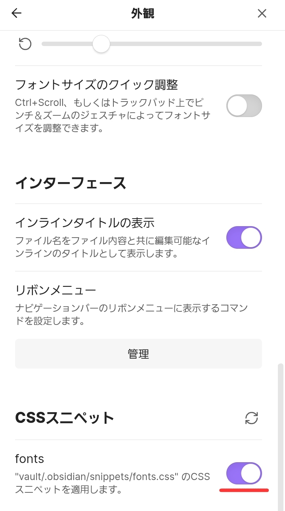
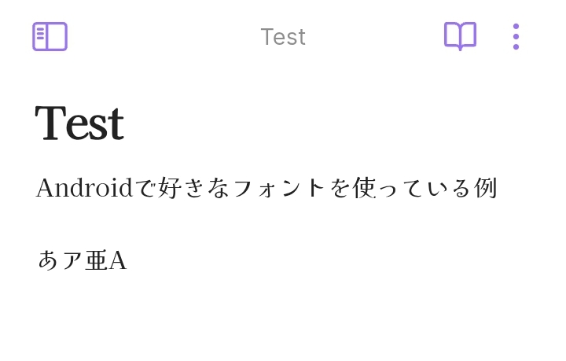

Obsidian使ってますか？

今回はスマホのObsidianで好きなフォントを導入します。

## なぜ？

パソコン上でのObsidianではシステムにフォントを入れれば自由に使うことができますが、Androidでは自由にフォントを入れる事ができません。そこで、カスタムCSSとしてフォントを導入します。

## 手順

### フォントをダウンロードする

お好きなフォントをダウンロードします。今回はGoogle Fontsから[Kaisei Opti](https://fonts.google.com/specimen/Kaisei+Opti)というフォント(このサイトで使われているフォントです♪)をダウンロードします。

ダウンロードして得られた`Kaisei_Opti.zip`を展開して、`KaiseiOpti-Regular.ttf`を取り出します。

### フォントをbase64形式に変換する

ダウンロードしたフォントをbase64に変換します。

Node.jsで下のスクリプトを`index.mjs`として保存します。

```js
import * as fs from "fs";

/**
 * fontの名前
 *
 * 好きなように変更してください。
 * Obsidianでこの名前が表示されます
 */
const fontName = "Kaisei Opti";

/**
 * fontが存在するpath
 */
const fontPath = "KaiseiOpti-Regular.ttf";

const font = fs.readFileSync(fontPath);
const base64 = font.toString("base64");

const cssOutput = `
@font-face {
    font-family: "${fontName}";
    src: url('data:font/ttf;base64,${base64}') format('truetype');
    font-weight: normal;
    font-style: normal;
}`;

fs.writeFileSync("fonts.css", cssOutput);
```

下のコマンドで実行します。

```sh
node index.mjs
```

これでフォントが含まれる`fonts.css`ファイルができました。

### Obsidianに導入する

作成した`fonts.css`をObsidianに導入します。

`fonts.css`をGoogle Drive, Dropboxなどお好きな方法でスマホにコピーします。著者はGitHubを通じてコピーしました。

このファイルを`<obsidian-vault>/.obsidian/snippets/`に移動させます。

最後に、Obsidianの`設定 > 外観 > CSSスニペット`をオンにして、`設定 > 外観 > フォント`から`Kaisei Opti (もしくはインストールしたフォント名)`を選択します。



## 結果



無事に使うことができました🎉